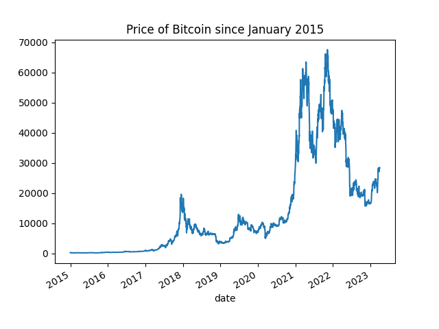
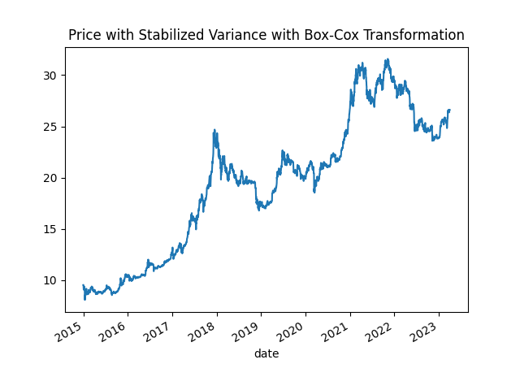
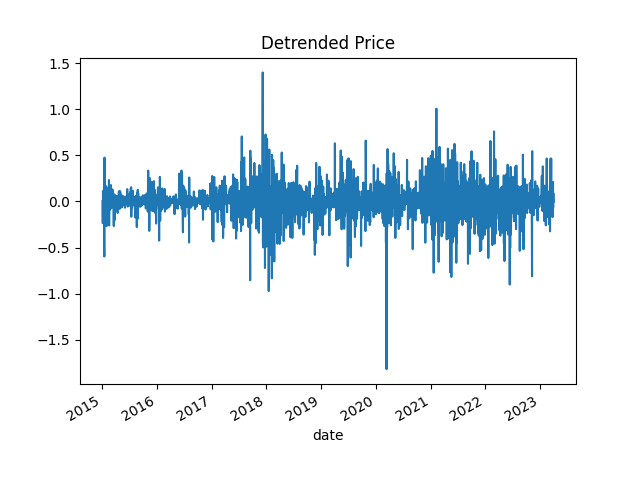
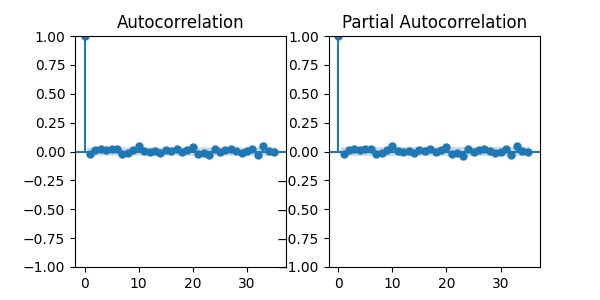

# Data Science Popularization: Financial Data Forecasting

Author: Morris Chan

While multiple time series forecasting method exist, how they actually perform on financial data is not publicly avaiable. Understanding some of the traditional methods may not provide any meaning forecast, I aim to apply a wide range of forecasting methods, from traditional to modern machine learning algorithms to demonstrate how powerful (or powerless?) they are on financial predictions. Still, results in this project should not be used to make any rigid conclusion on how bad any method is, as some of the models applied may not be fine-tuned enough and can potentially outperform others given certain conditions.

## Methodology

Due to the recent public interest in cryptocurrency, we are only using the price of Bitcoin as the target time series in the preliminary stage of this project.

### Data Acquisition

The data of interst was downloaded from a kaggle data set [Cryptocoins Historical Prices - CoinGecko](https://www.kaggle.com/datasets/sudalairajkumar/cryptocurrency-historical-prices-coingecko?select=bitcoin.csv). The data set was created with [CoinGecko API](https://www.coingecko.com/en/api), having historical prices of 50 currencies. We are mostly intersted in Bitcoin, which has its historical price since January 1st 2015 to April 1st 2023 (the day when the project is started) in the data set.

### Forecasting Methods

We started with traditional forecasting methods including exponential smoothing based approaches and the ARIMA method. Machine learning based method will be added shortly.

## Results

We first plot our data to visually inspect the time series.

### ARIMA model

To use an ARIMA model, the time series should be stationary. A stationary time series should have a constant mean (e.g., no trend) and a constant variance (e.g., no seasonality).

Having observed the increased variance from 2021 to 2023, we first performed a Box-Cox transformation to stabilize the variance.

Then, we used first order differencing to detrend the time series.

Now the transformed time series become stationary.

To determine the orders used in the ARIMA model, we need to inspect the autocorrelation function and the partial autocorrelation function.

Unfortunately, there is no observed autocorrelation in both functions. ARIMA models will not be a suitable option for forecasting Bitcoin price.